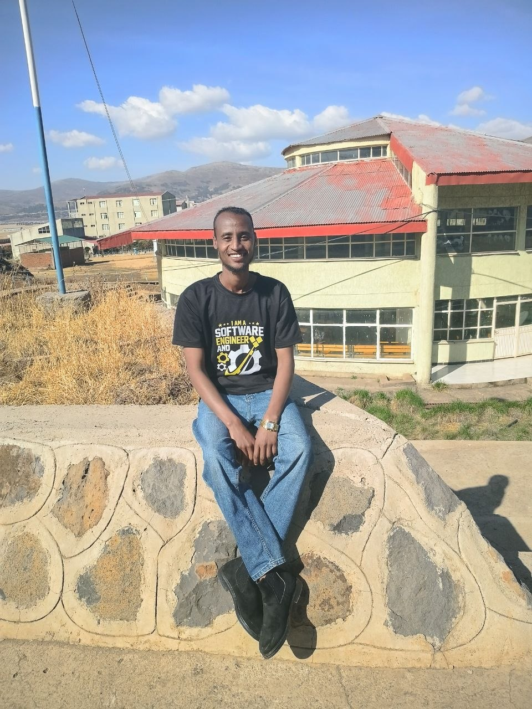

<!-- Profile Header -->

  <!-- Left: Profile Image -->
  

    
  

  <!-- Right: Name and Title -->
  

    <h1 style="margin: 0;">Hi 👋, I'm Eliyas Lulie</h1>
    <h3 style="margin-top: 10px;">
      I'M A Software Engineer & Full-Stack Developer
    </h3>
  

<!-- Profile Views -->

  

---

## 🚀 About Me
- 🎓 Software Engineering Student  
- 💻 Building **University Online Clearance Systems**
- 🌐 Working with **React, Django, Flutter**
- 🗄️ Databases: **MySQL, SQLite**
- 🚀 Passionate about **clean UI & scalable systems**

---

## 🛠️ Tech Stack

  

---

## 📌 Projects
- 🏫 **University Online Clearance System**  
  Full workflow system with role-based approval  
  `React + Django + MySQL`

- 📱 **Flutter University App**  
  Student clearance & approval tracking

- 🔢 **Geez ↔ Arabic Number Converter App**

---

## 📊 GitHub Stats

  

  

---

## 📫 Connect With Me
- GitHub: [@Lulieeliyas](https://github.com/Lulieeliyas)
- Email: **lulieeliyas@gmail.com**
- Website: https://my-websites-qx7p.vercel.app/

---

⭐ *“Code is not just code — it’s a solution.”*
